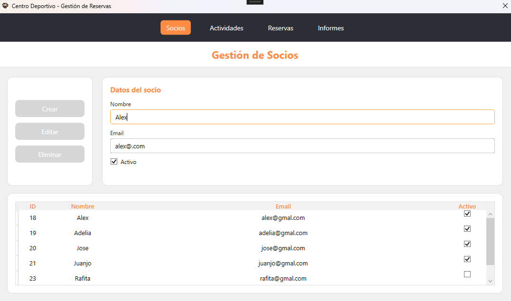
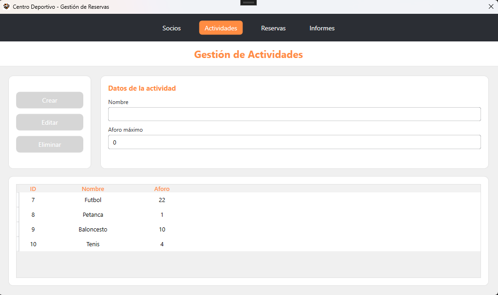
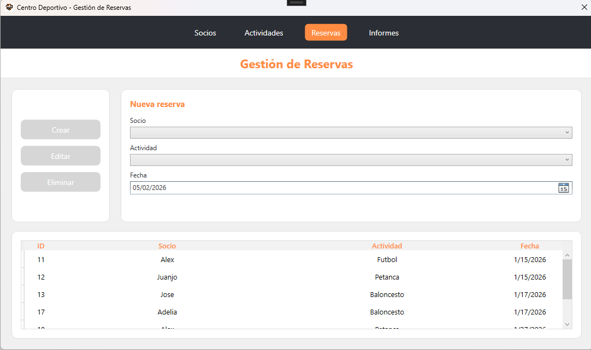
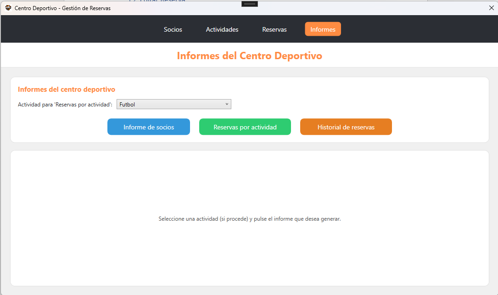
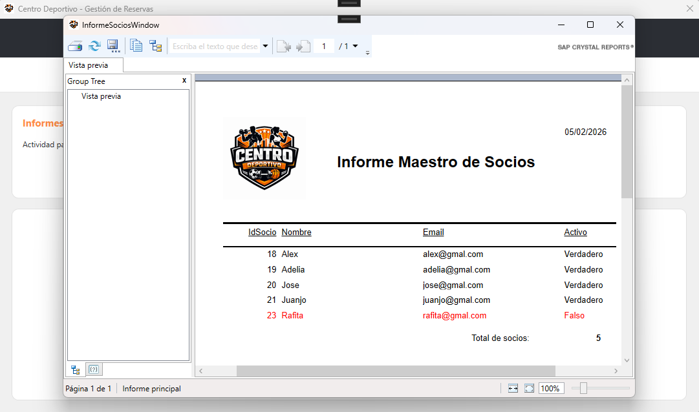
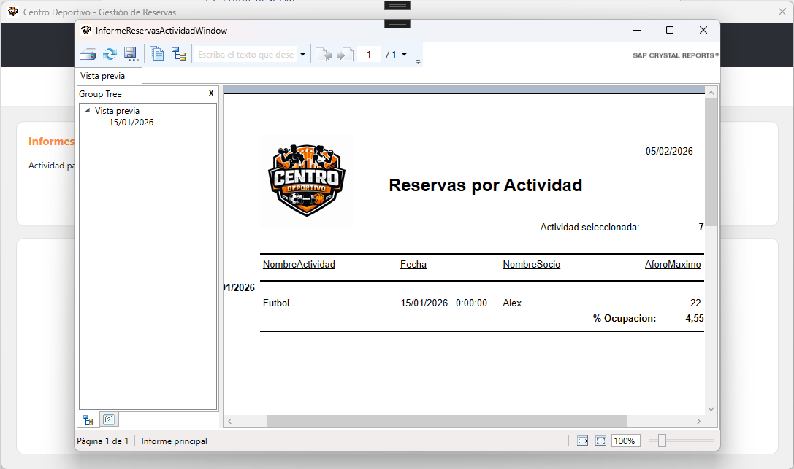
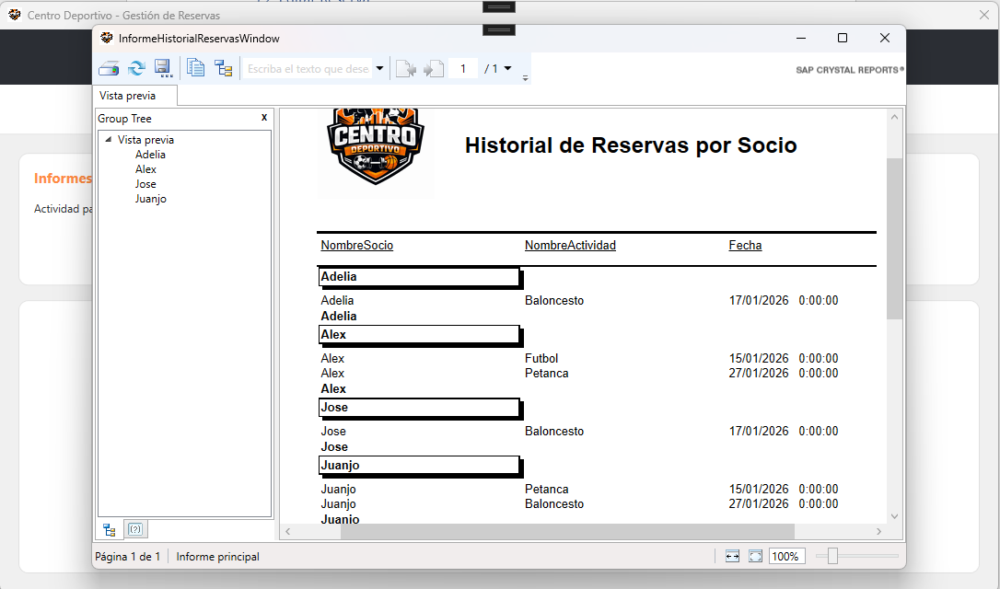

# 🏋️CentroDeportivo - Sistema de Gestión

Sistema de escritorio desarrollado en WPF que permite gestionar de forma eficiente socios, actividades y reservas de un centro deportivo, con generación de informes profesionales mediante Crystal Reports.


## 📋 Descripción del Proyecto

**Centro Deportivo** es una aplicación de escritorio que implementa el patrón arquitectónico **MVVM** (Model-View-ViewModel) para la gestión integral de un centro deportivo. La aplicación permite:

- ✅ **Gestión de Socios**: Registro, edición y eliminación de miembros del centro
- ✅ **Gestión de Actividades**: Administración de actividades deportivas con control de aforo
- ✅ **Gestión de Reservas**: Sistema de inscripciones con validación de fechas y capacidad
- ✅ **Generación de Informes**: Reportes profesionales en Crystal Reports
- ✅ **Validaciones en tiempo real**: Control de datos y restricciones de negocio
- ✅ **Interfaz intuitiva**: Diseño moderno y fácil de usar

### 🎯 Características principales

- **Patrón MVVM**: Separación completa entre lógica de negocio y presentación
- **Data Binding**: Actualización automática de la interfaz
- **Commands**: Desacoplamiento de eventos mediante ICommand
- **Entity Framework 6**: Acceso a datos con ORM
- **Validaciones**: Control de emails, fechas, aforo y restricciones de integridad
- **Servicios**: Arquitectura basada en interfaces para mejor testabilidad
- **Pruebas unitarias**: Tests con MSTest para validaciones críticas

---

## 🛠️ Tecnologías Utilizadas

### **Framework y Lenguajes**
- **.NET Framework 4.8**
- **C#**
- **WPF** (Windows Presentation Foundation)
- **XAML** para diseño de interfaces

### **Arquitectura y Patrones**
- **Patrón MVVM** (Model-View-ViewModel)
- **Repository Pattern** mediante servicios
- **INotifyPropertyChanged** para notificaciones de cambios
- **ICommand** para manejo de comandos

### **Acceso a Datos**
- **Entity Framework 6** (Database First)
- **SQL Server** como motor de base de datos
- **LINQ to Entities** para consultas

### **Generación de Informes**
- **SAP Crystal Reports** para .NET Framework
- **CrystalReportsViewer** para visualización

### **Pruebas**
- **MSTest** para pruebas unitarias y de integración
- Tests de validación de emails, fechas y aforo

### **Control de versiones**
- **Git** y **GitHub**

---


## 📦 Instalación

### **Requisitos previos**

Antes de instalar la aplicación, asegúrese de cumplir con los siguientes requisitos:

1. **Sistema operativo**: Windows 10 o superior
2. **Componentes necesarios**:
   - **.NET Framework 4.8** o superior
   - **SQL Server**
   - **Crystal Reports Runtime** para .NET Framework

---

### **Opción 1: Instalación mediante ClickOnce (Recomendada para usuarios finales)**

#### **Pasos para el administrador del sistema:**

1. **Publicar la aplicación desde Visual Studio**:
   - Abra el proyecto en Visual Studio 2022 o superior
   - Haga clic derecho sobre el proyecto `CentroDeportivo.View`
   - Seleccione **"Publicar"** (Publish)

2. **Configurar el método de publicación**:
   - Seleccione **ClickOnce** como método de publicación
   - Elija la ubicación de instalación

3. **Configurar opciones de instalación**:
   - **Modo de instalación**: Online o Offline
   - **Actualizaciones**: Automáticas o manuales
   - **Requisitos previos**: Marque .NET Framework 4.8

4. **Generar el instalador**:
   - Haga clic en **"Finalizar"**
   - Visual Studio generará:
     - `setup.exe` (instalador)
     - Archivos de manifiesto
     - Archivos de la aplicación

#### **Pasos para el usuario final:**

1. **Acceder a la ubicación de instalación**:
   - Navegue a la carpeta compartida o sitio web configurado
   - Localice el archivo `setup.exe`

2. **Ejecutar el instalador**:
   - Haga doble clic en `setup.exe`
   - Si aparece un aviso de seguridad, haga clic en **"Instalar"**

3. **Completar la instalación**:
   - El instalador descargará e instalará automáticamente:
     - La aplicación
     - Las dependencias necesarias
   - Se creará un acceso directo en el escritorio y en el menú Inicio

4. **Iniciar la aplicación**:
   - Haga doble clic en el icono del escritorio
   - O búsquela en el menú Inicio: **"Centro Deportivo"**

---

### **Opción 2: Instalación manual (Para desarrolladores)**

#### **1. Clonar el repositorio**

```bash
git clone https://github.com/alexMartJu/CentroDeportivo_MVVM_WPF_NETFramework_CrystalReports.git
cd CentroDeportivo_MVVM_WPF_NETFramework_CrystalReports 
```

#### **2. Configurar la base de datos**

1. **Crear la base de datos**:
   - Abra SQL Server Management Studio
   - Ejecute el script de creación de base de datos (ubicado en `/Database/CreateDatabase.sql`)
   - Esto creará la base de datos `CentroDeportivo` con las tablas:
     - `Socios`
     - `Actividades`
     - `Reservas`

2. **Configurar la cadena de conexión**:
   - Abra los archivo `App.config` del proyecto
   - Modifique las cadenas de conexión según su configuración

#### **3. Restaurar paquetes NuGet**

#### **4. Compilar la solución**

#### **5. Ejecutar la aplicación**

---

## 🚀 Cómo Ejecutar

### **Ejecución normal**

1. **Localice el ejecutable**:
   - Si instaló con ClickOnce: Use el acceso directo del escritorio
   - Si está utilizando Visual Studio: clicar en Iniciar

2. **Inicie la aplicación**:
   - Haga doble clic en el icono
   - La aplicación verificará automáticamente la conexión a la base de datos

3. **Navegación inicial**:
   - Por defecto, se abre la sección **"Socios"**
   - Use el menú superior para navegar entre secciones:
     - 📋 Socios
     - 🏃 Actividades
     - 📅 Reservas
     - 📊 Informes

---

## 📸 Capturas de Pantalla

### **1. Ventana Principal - Gestión de Socios**

> *Vista principal mostrando el listado de socios con opciones de crear, editar y eliminar. Incluye validación de emails y control de estado activo/inactivo.*

---

### **2. Gestión de Actividades**

> *Administración de actividades deportivas con control de aforo máximo. Validación automática antes de eliminar actividades con reservas asociadas.*

---

### **3. Gestión de Reservas**

> *Sistema de inscripciones con selectores de socio, actividad y fecha. Validación automática de aforo disponible y fechas válidas.*

---

### **4. Selección de Informes**

> *Panel de selección de informes con tres opciones disponibles: Informe de socios, Reservas por actividad e Historial completo.*

---

### **5. Informe de Socios en Crystal Reports**

> *Informe maestro de socios mostrando ID, nombre, email y estado.*

---

### **6. Informe de Reservas por Actividad**

> *Informe filtrado por actividad específica mostrando todas las reservas, fechas y aforo ocupado.*

---

### **7. Informe del Historial de Reservas**

> *Historial completo de todas las reservas ordenadas cronológicamente con información de socio y actividad.*

---

## 🧪 Pruebas Unitarias y de Integración

El proyecto incluye pruebas unitarias y de integración con **MSTest** para validar la lógica crítica:

### **Ejecutar todas las pruebas**

Desde Visual Studio > Menú "Ver" > "Explorador de pruebas" > "Ejecutar todas las pruebas de la vista"

### **Pruebas incluidas**

#### **1. EmailTests** - Validación de formato de emails
#### **2. FechaReservaTests** - Validación de fechas
#### **3. AforoTests** - Control de aforo máximo

---

## 🔒 Seguridad y Validaciones

### **Validaciones implementadas**

| Tipo | Descripción |
|------|-------------|
| **Email único** | No permite duplicados en la base de datos |
| **Formato de email** | Validación con expresiones regulares |
| **Fechas válidas** | No permite fechas pasadas en reservas |
| **Control de aforo** | Verifica capacidad antes de crear/editar reservas |
| **Integridad referencial** | No permite eliminar entidades con dependencias |
| **Campos obligatorios** | Deshabilita botones si faltan datos |

### **Restricciones de base de datos**

- 🔑 **Claves primarias**: Identity en todos los IDs
- 🔗 **Claves foráneas**: Relaciones entre Socios, Actividades y Reservas
- 🚫 **Restricciones ON DELETE RESTRICT**: Prevención de eliminación en cascada
- ✅ **Índices únicos**: Email en la tabla Socios

---

## 🤝 Contribuir

¡Las contribuciones son bienvenidas! Si desea mejorar este proyecto:

1. **Fork** el repositorio
2. Cree una **rama** para su feature (`git checkout -b feature/NuevaCaracteristica`)
3. **Commit** sus cambios (`git commit -m 'Añadir nueva característica'`)
4. **Push** a la rama (`git push origin feature/NuevaCaracteristica`)
5. Abra un **Pull Request**

### **Guías para contribuir**

- Siga el patrón MVVM establecido
- Mantenga la separación de capas
- Añada pruebas unitarias para nuevas funcionalidades
- Documente el código con comentarios XML
- Siga las convenciones de nomenclatura de C#

---

## 👨‍💻 Autores

### **Desarrollador Principal**

**Alex Martínez Juan**
- 💼 GitHub: [@alexMartJu](https://github.com/alexMartJu)

---

## 🌟 ¡Dale una estrella!

Si este proyecto te ha sido útil, considera darle una ⭐ en GitHub. ¡Gracias!

---